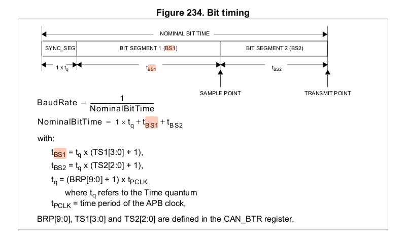

baud & bit
----------

In the context of STM32 microcontrollers, the APB (Advanced Peripheral Bus) clock is one of the buses used for connecting peripherals, and it's typically derived from the system clock (HCLK). The time period of the APB clock refers to the duration of one clock cycle on this bus. It is the reciprocal of the frequency.

The formula to calculate the time period (T) is:

\[ T = \frac{1}{\text{APB clock frequency}} \]

Where:

- \( T \) is the time period.
- \(\text{APB clock frequency}\) is the frequency of the APB clock.

So, if you have the frequency of the APB clock, you can calculate the time it takes for one clock cycle.

For example, if the APB clock operates at 36 MHz, the time period (\( T \)) would be:

\[ T = \frac{1}{36 \, \text{MHz}} \approx 27.78 \, \text{ns} \]

Understanding the time period of the APB clock is important when configuring peripherals that depend on timing, such as setting up the baud rate for communication peripherals like USART, SPI, or CAN. These peripherals often have timing parameters specified in terms of clock cycles or time intervals, so knowing the time period allows you to set these parameters accurately.

