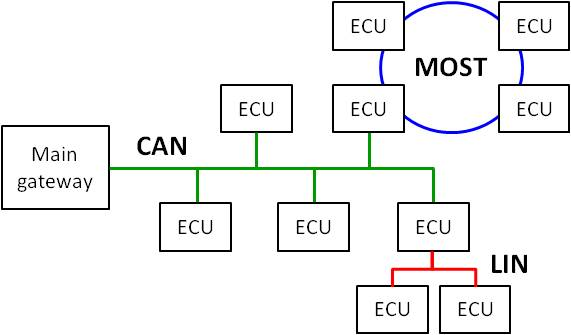

Networks
========

Controller Area Network (CAN) emerged as a communication network by Bosch GmbH specifically tailored for the automotive industry in 1985. It operates on a message-based broadcast protocol.

Given its maximum bandwidth of 1 Mbit/s, CAN proves inadequate for transferring video and audio data. Hence, Media Oriented Systems Transport (MOST) serves this purpose . MOST, a fiber-optic ring network, is meticulously engineered for the efficient transmission of large data volumes within automotive systems. Nodes within a MOST network aren't directly accessible; they are only reachable via specialized CAN ECUs functioning as gateways.

To alleviate CAN's load, Local Interconnect Network (LIN) establishes a sub-network on CAN for communicating with low-performance ECUs. Access to LIN is orchestrated through the CAN master node, which oversees slave nodes within this network.

