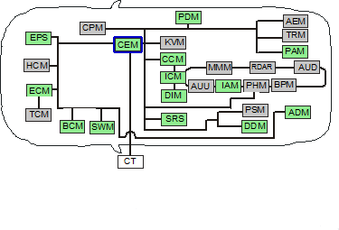
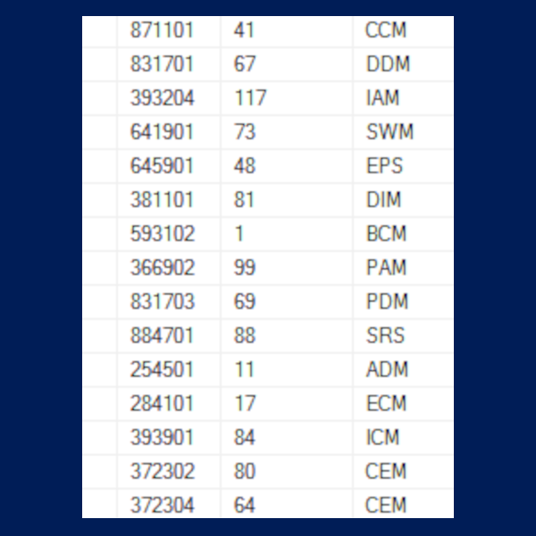

Volvo V50 modules overview
--------------------------

This is an overview of the modules in a volvo V50.

in the vida software you can find an overview that looks like this : 

in the log of the diagnostic session I found a link between:

- the vida xml module ID
- the can message ID ? (to be confirmed)
- the module description

Modules:
--------

- CEM     Central Electronic Module (Behind right side of dash)
- EPS     Electrical Power Steering module (Right front corner of engine compt)
- BCM     Brake Control Module (At left rear corner of engine compt)
- HCM     Headlamp Control Module (Behind left headlight) (Active lights only, (S40/V50))
- SWM     Steering Wheel Module (Top of steering column)
- ECM     Engine Control Module (Left front of engine compt)
- TCM     Transmission Control Module (Rear of engine compt) (Automatic transmission only)
- ADM     Additive Dosing Module (Diesel only)

