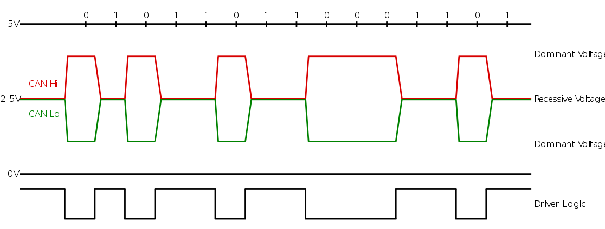
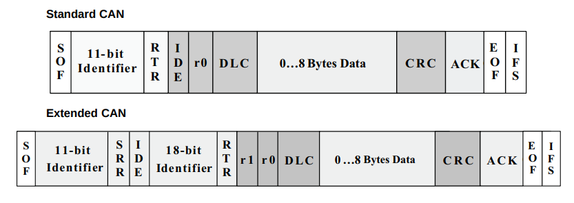
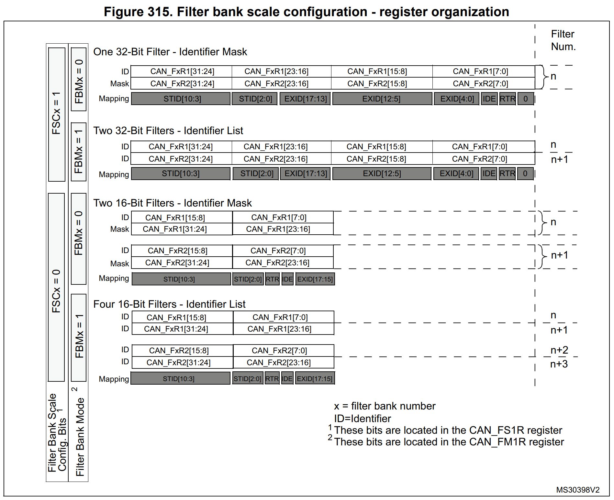

further info on canbus:
-----------------------

Volvo uses extended identifiers:
-------------------------------

CAN frames follow a defined format: all standard frames have an 11-bit
identifier and up to 8 bytes of data. Extended frames allow 29 bit identifiers,
but only the same 8 bytes of data. CAN frames also include checksums, and most
CAN implementations in microcontrollers will automatically insert / verify
checksums in hardware. 

