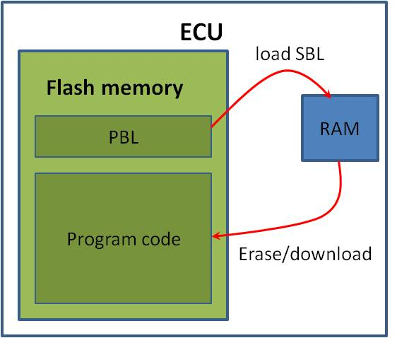

Bootloaders
-----------

When initializing, the ECU first initiates the boot loader. The boot loader comprises two distinct parts: a primary boot loader (PBL) and a secondary boot loader (SBL). In its default mode, the PBL loads the application software stored in the flash memory. Due to specific constraints such as a small memory size (16k) and the inability to be modified post-production, the PBL is unsuitable for programming or updating data in the flash memory. For these tasks, the SBL is utilized. The SBL is transferred by the primary loader into RAM and subsequently activated. It then assumes responsibility for managing the flash memory, including tasks such as erasing or reprogramming, and the software download process.

The software download process
-----------------------------

To download data, the ECU should be put in programming mode. First the SBL is
downloaded into RAM by means of PBL. After SBL is activated, clear the flash memory. The next step is the download of
data files. Finally the ECU is reset to erase RAM and put back in default mode.
