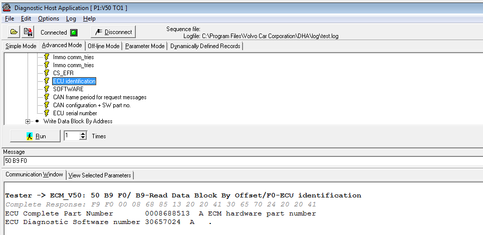

GGD-DHA (  Hacking - or modifying the database ).
================================================

This software uses databases in (ddb, dds) format.
The cool thing is that this software works with the DICE cable.
ddb database format is text format and can be edited.

I created a small database for working with my V50.
The CANBUS messages for the V50 can be found in the VIDA database/XML files.

I created a sample to interact with a stm32, so it sends a serial number upon request, pretending it is an ECM module (0x50).  
(can be found under the stm32f103c6-canbus directory)

conclusion : 
------------

this is an easy way to interact with all the modules in your car at no extra cost, provided you already have the DICE cable, and without programming, modifying the database in a texteditor will do.

