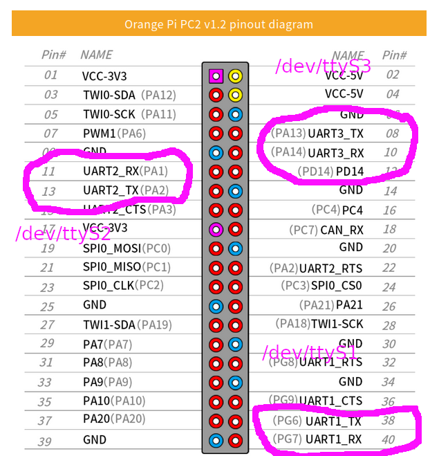

using a serial port
===================

Due to non working usb-uart plugs, I used what I had : an orange pi pc, running armbian. This allowed me to configure 3 serial ports.

Later on in my project I configured a stm32f103c6 to be used as an uart bridge.

using the GPIO header of an orange pi
-------------------------------------

I use armbian on a orange pi.

   
.. code-block:: bash

    sudo armbian-config

In the Armbian configuration utility, navigate to *System > Hardware* and select the appropriate option to apply device tree overlays.

